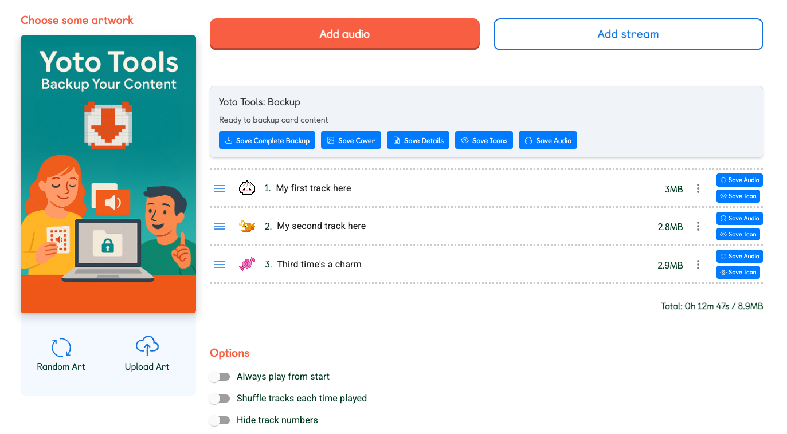

<div align="center">

  
  
  <h1 style="margin: 0.5em 0;">Yoto Tools</h1>

  
  [](https://github.com/trywait/YotoTools/blob/main/LICENSE)

  A Chrome extension for creating personal backups of your legally purchased and MYO Yoto card content.
  
  <hr>

  [](https://github.com/trywait/YotoTools/commits/main)
  
  [](https://github.com/trywait/YotoTools/issues)
  [](https://github.com/trywait/YotoTools/issues?q=is%3Aissue+state%3Aclosed)

</div>

<div align="center">

---
[Features](#features) | [Installation](#installation) | [Usage](#usage) | [Privacy & Security](#privacy--security) | [Development](#development) | [Legal](#legal-disclaimer)

---

</div>

> 👾 **Looking to create pixel art for your Yoto MYO cards?** Check out [YoPix](https://yopix.ordinarytools.com/) (live demo) - a free 16×16 pixel art editor designed specifically for Yoto cards and playlists! (You can also run it locally: [GitHub](https://github.com/trywait/yopix-public))


<div align="center">
  
  <br>
  <em>Yoto Tools Share Page Preview</em>
</div>

<div align="center">
  
  <br>
  <em>Yoto Tools MYO Playlist Page Preview</em>
</div>

# Yoto Tools Chrome Extension

A Chrome extension designed to help Yoto card owners create personal backups of their legally purchased and created content. This tool assists in archiving your owned Yoto card and MYO content for personal use and backup purposes.

## Important Notice (Legal TLDR)

This extension is designed for:
1. **Personal Backup**: Creating archives of your created and purchased content
2. **Offline Access**: Ensuring access to your owned content when internet isn't available

[Read More Here](#legal-disclaimer)

## ✨ What's New in Version 2.1 ✨

- **Zip Download Option**: Added a "Save All (Zip)" button to download all card content (audio, icons, cover, details) as a single compressed ZIP file.
- **MYO Card Support**: You can now backup your own content directly from the "Edit your playlist" MYO page (`my.yotoplay.com/card/*/edit`). This includes downloading your uploaded audio tracks, icons, cover art, and details.
- **Unified UI**: The user interface has been updated for consistency across both share pages and MYO edit pages. Buttons are injected directly into the page for easy access.
- **Improved Stability**: Refactored background processes for API communication and download management. Uses `chrome.storage.local` for more reliable state persistence.
- **Plays Nice with MYO Studio**: You can use both without them interfering... We are all on the same team 🤙

## Features

- 🔒 **Personal Backup**: Create backups of your purchased Yoto card content
- 📚 **Content Archive**: Save and organize your owned content for offline access
- 🎨 **Simple UI**: Clean and simple design with synchronized state and progress display, injected directly into the page so you don't have to activate the extension.
- 🔐 **Privacy-Focused**: Works entirely client-side with minimal permissions
- 📼 **MYO Backup**: Backup your own uploaded content from the *Edit your playlist* page (`my.yotoplay.com/card/*/edit`).
- 📦 **Zip Option**: Download all card content as a single, convenient ZIP file.

## Prerequisites

Before using this extension, you'll need:
- Google Chrome Browser
- This extension installed manually (steps below)
- NFC Tools app ([Android](https://play.google.com/store/apps/details?id=com.wakdev.wdnfc) | [iOS](https://apps.apple.com/us/app/nfc-tools/id1252962749))
  - For iOS: Requires iPhone 7 or newer with iOS 15.6+
  - Free app with optional Pro features
- Your legally purchased Yoto cards

## Installation

### Manual Installation (Developer Mode)

> This is not in the Chrome Web Store, so you will need to upload it manually using "Developer Mode"

1. Download or clone this repository (by pasting this into your terminal):
   ```bash
   git clone https://github.com/trywait/YotoTools.git
   ```
2. Open Chrome and go to `chrome://extensions/`
3. Enable "Developer mode" in the top-right corner
4. Click "Load unpacked" in the top-left corner
5. Select the unzipped folder containing the extension files
6. Once loaded, click the puzzle piece icon (Extensions) in Chrome's toolbar
7. Find "Yoto Tools" in the dropdown list
8. Click the pin icon next to it to keep it visible in your toolbar (optional)

## Usage (Owned Cards)

### Step 1: Get Your Card's URL (for Purchased Cards)
1. Install NFC Tools on your mobile device:
   - [iOS App Store](https://apps.apple.com/us/app/nfc-tools/id1252962749) (requires iPhone 7 or newer, iOS 15.6+)
   - [Android Play Store](https://play.google.com/store/apps/details?id=com.wakdev.wdnfc)
2. Open NFC Tools and scan your Yoto card (Read)
3. Look for "Record 1" in the scan results

<div align="center">
  
  <br>
  <em>Look for the Record 1 URL in NFC Tools after scanning your card</em>
</div>

4. Find the URL that looks like: `yoto.io/ABC123?xxxxxxx=yyyyyyyy`
5. Copy or note down this URL

### Step 2: Access the Card Page
1. On your computer (not phone), open Chrome
2. **For Purchased Cards**: Paste the `yoto.io` URL you found in Step 1 into the address bar. The URL will redirect to the official Yoto card page (`share.yoto.co`).
3. Wait for the page to fully load.

### Step 3: Use the Extension
1. Once on the card page (after it redirects), you'll see download buttons directly on the screen:
   *Note: Do not refresh this page as it will lead to a 404 error. If this happens, simply return to Step 1.4 and re-enter the original `yoto.io` URL. Yoto Originals cannot be backed up.*
   
   <div align="center">
     
   </div>
   
   - **Save All**: Downloads all card content into an organized folder named after the card.
   - **Save All (Zip)**: Downloads all card content as a single `.zip` file named after the card.
   - **Save Cover**: Downloads the card's cover art.
   - **Save Details**: Saves a text file with the card's information— Title, description, author, and track list.
   - **Save Icons**: Downloads all available track icons.
   - **Save Audio**: Downloads all available audio tracks.
   
   <div align="center">
     
   </div>
   
   - **Individual Track Buttons**: Small "Save Audio" and "Save Icon" buttons appear next to each track, allowing individual downloads.
   
2. You can also click the Yoto Tools extension icon in your Chrome toolbar for quick actions on the share page (though the primary interface is now injected on the page).

## Usage (MYO Cards / Playlists)

### Step 1: Select an MYO card from the [My playlists](https://my.yotoplay.com/my-cards) page

<div align="center">
  
  <br>
  <em>Backup your MYO content</em>
</div>

### Step 2: Backup your content
1. Wait for the page to fully load.

   - **Save All**: Downloads all card content into an organized folder named after the card.
   - **Save All (Zip)**: Downloads all card content as a single `.zip` file named after the card.
   - **Save Cover**: Downloads the card's cover art.
   - **Save Details**: Saves a text file with the card's information— Title, description, author, and track list.
   - **Save Icons**: Downloads all available track icons.
   - **Save Audio**: Downloads all available audio tracks.
   - **Individual Track Buttons**: Small "Save Audio" and "Save Icon" buttons appear next to each track, allowing individual downloads.
   
### Locate Your Backups
1. By default, files are saved to your computer's Downloads folder
2. If using "Save All", a new folder will be created named after your card (e.g., "Jack and the Beanstalk"). Inside the folder, you'll find:
   - Audio files named: `XX - [Title].[format]`, etc.
   - Track images named: `X - [Track Title].[format]`, etc. (if available)
   - Cover artwork named: `Cover Art - [Card Title].[format]`
   - Card information saved as: `[Card Title] - Details.txt`
3. If using "Save All (Zip)", a single `.zip` file named after your card will be downloaded. Inside the zip file, the content will be organized similarly.
4. Filenames are automatically generated based on track number and title.

*Note: Audio files are downloaded in .mp4 format. For better compatibility with media players and devices, you may want to convert them to .mp3 format. We recommend using [FFmpeg](https://ffmpeg.org/) ([GitHub](https://github.com/FFmpeg/FFmpeg)) or another audio conversion tool of your choice to process the files.*

### Important Notes
- Always ensure you're backing up cards you legally own or have created.
- Keep your backups secure and for personal use only.
- For MYO cards, this tool helps you back up the content *you have uploaded* yourself (requires you to be logged in).
- The extension works on official Yoto card pages matching these patterns:
  - **Purchased Cards**: `https://play.yotoplay.com/*/card/*` and `https://share.yoto.co/*`
  - **Your MYO Playlist (Edit Page)**: `https://my.yotoplay.com/card/*/edit`
- Make sure to keep your NFC Tools app updated if using it for purchased cards.

## Privacy & Security

We prioritize your privacy:
- No data collection
- No external servers (except for necessary calls to Yoto's API for MYO card data retrieval, proxied through the background script)
- All processing happens locally in your browser
- No analytics or tracking
- Your content remains private and secure

## Development

For detailed information about the project's structure, components, and how they interact, please see the [ARCHITECTURE.md](ARCHITECTURE.md) document. This includes comprehensive documentation about:
- Component roles and responsibilities
- Communication flow between components
- State management
- Data flow
- Future considerations

### Project Structure
```
yoto-tools/
├── icons/            # Extension icons (16, 32, 48, 128px)
│   ├── 16.png        # Small icon for extension menu
│   ├── 32.png        # Medium icon for extension menu
│   ├── 48.png        # Large icon for extension menu
│   └── 128.png       # Extra large icon for Chrome Web Store
├── jszip.min.js      # JSZip library for ZIP creation
├── images/           # Documentation images and GIFs
├── popup.html        # Extension popup interface
├── popup.js          # Popup functionality and state synchronization
├── content.js        # Content script for page interaction (handles different domains)
├── background.js     # Service worker for download handling & MYO API requests
├── manifest.json     # Extension configuration
├── ARCHITECTURE.md   # Detailed technical documentation and component interactions
├── LICENSE           # MIT License file
└── README.md         # User documentation and setup guide
```

### Technical Details

#### State Management
- The content script (`content.js`) manages the visual state of the injected UI elements directly.
- The background script (`background.js`) manages the overall download state (progress, status) using `chrome.storage.local` for persistence.
- The popup (`popup.js`) queries the state from `chrome.storage.local` via the background script when opened and listens for updates.

#### User Interface
- Clean, modern design injected directly into the page for easy access.
- Real-time progress updates and button state changes.
- Consistent state display across interface elements.

### Building from Source
1. Clone the repository
2. Make any desired modifications
3. Load the extension in Chrome using Developer mode

## Contributing

We welcome contributions that respect intellectual property rights and focus on:
- Improving backup functionality
- Enhancing user privacy
- Strengthening security
- Improving documentation

## License

This project is licensed under the MIT License - see the LICENSE file for details.

## Legal Disclaimer

This tool is not affiliated with, endorsed by, or sponsored by Yoto. Yoto is a registered trademark of Yoto Limited.

This tool is provided "as-is" and "as-available" without any warranty of any kind, either express or implied, including but not limited to the implied warranties of merchantability, fitness for a particular purpose, title, or non-infringement. The developers, contributors, and maintainers of this tool shall not be liable for any damages or losses arising from its use, whether direct, indirect, incidental, special, consequential, or exemplary, including but not limited to loss of data, profits, or functionality.

The developers, contributors, and maintainers:
- Are not affiliated with, endorsed by, or sponsored by Yoto or any associated entities
- Make no representations or warranties about the accuracy or completeness of the tool's content or functionality
- Disclaim all liability for any damages or losses resulting from the use of this tool
- Do not guarantee the tool's compatibility with any specific version of Yoto's services or content

This tool is designed solely for creating personal backups of legally purchased or user-created content. Users are solely responsible for ensuring their use of this tool complies with:
- Copyright laws and intellectual property rights
- Terms of service of content providers
- Licensing agreements
- Local regulations regarding content backup and usage
- Data protection and privacy laws
- Any other applicable laws or regulations

*For MYO cards, this tool facilitates the backup of content uploaded by the user to their own cards.*

The developers do not endorse, encourage, or accept any responsibility for:
- Unauthorized copying or distribution of copyrighted material
- Violations of terms of service or user agreements
- Any illegal or unauthorized use of this tool
- Any modifications made to downloaded content
- Any consequences resulting from the use or misuse of this tool

By using this tool, you acknowledge and agree to these terms and accept full responsibility for ensuring your use complies with all applicable laws and regulations.

## Support

If you encounter any issues or have questions:
1. Check the [Issues](https://github.com/trywait/YotoTools/issues) page
2. Create a new issue if needed
3. Provide detailed information about the problem

---

Made with ❤️ for the Yoto community for personal use